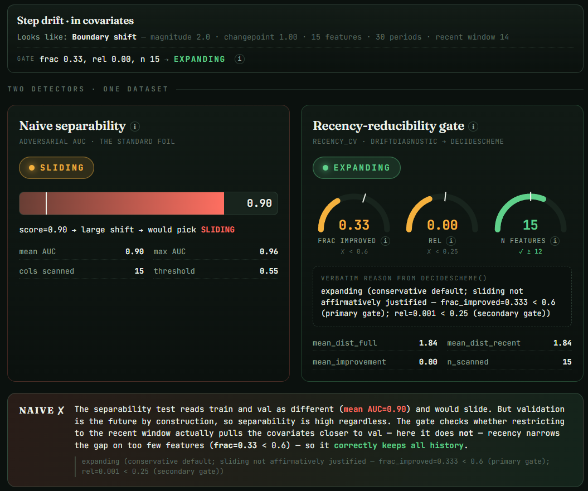

# The Recency-Reducibility Gate

A cross-validation gate that decides between an **expanding** and a **sliding** time-series CV
window by detecting whether train→validation drift is *recency-reducible* — whether restricting
training to its most recent block actually moves the covariates closer to validation — rather than
merely whether train and validation look different.



*The foil at its sharpest. The screenshot shows one of the simulator's built-in scenarios, "boundary
shift," where the drift is placed exactly at the train/validation boundary — a prebuilt preset, not a
tuned or cherry-picked example. The naive adversarial-AUC test is confidently wrong (mean AUC **0.90**)
and votes **SLIDING**, but because the shift sits at the boundary the recent window can't reach it —
`mean_improvement = 0.00`, so `frac_improved = 0.33` and `rel = 0.00` across all `n = 15` features — and
the gate correctly holds **EXPANDING**. Unlike the thin-evidence floor, here both the breadth and depth
gates fail because recency genuinely doesn't help, not because the scan is too thin.*

- **▶ Try it live:** <https://isaacpan1.github.io/Recency-Reducibility-Gate/demo/index.html>
- **🎥 Watch the walkthrough (video):** <https://youtu.be/_LKXguh5s0o> — a short walkthrough of how to use the demo

---

## 1. Introduction

Time-series cross-validation mimics the real task it is meant to estimate: predict a future window
from past data. Because of that, the *shape* of the CV window is a real modeling choice, not a
detail. An **expanding** window trains on all available history; a **sliding** window trains only on
the most recent block. Under a stable distribution, expanding wins — more data, lower variance. Under
distribution shift, the trade flips: old history can actively mislead, and a recent window can
generalize better to the future. Choosing the wrong window quietly costs accuracy on exactly the
holdout that is supposed to stand in for production.

The usual way to make that choice is to measure how *separable* train and validation are — train an
adversarial classifier to tell training rows from validation rows, or run a per-feature KS test, and
read high separability as "large shift, switch to sliding." It is a reasonable-sounding heuristic and
a common one. It is also, on a forecasting holdout, almost always wrong.

## 2. Why the naive separability test fails here

On a forecasting holdout, validation **is** the future by construction. A time index, a seasonal
phase, or any slow trend already makes train and validation trivially distinguishable before any real
drift exists. So an adversarial AUC (or a KS statistic) saturates near its maximum on essentially
every forecasting set, whether or not recency would actually help. A gate built on separability
therefore recommends sliding almost always — discarding history for no measurable gain.

The live demo makes this concrete. On a large synthetic panel built to exercise the gate — 135,000 rows
of many series tracked over weeks, in a retail-style `stores × products × weeks` layout — the
adversarial separability test reports a mean AUC of **≈0.62** (well above its 0.55 "slide" threshold)
and votes SLIDING, yet restricting to the recent window does nothing to bring the covariates closer to
validation, so sliding would throw away history for nothing.

## 3. The contribution — the gate's extra checks

The gate asks the question sliding can actually act on: *does the recent slice of train look more like
validation than the full slice does?* The metric is a **standardized mean shift** — an effect size,
`|mean(a) − mean(b)| / pooled_std`, with population variance (`np.var`, ddof=0) and a `<5`-valid-values
→ NaN rule (`standardized_mean_shift` in `recency_cv/gate.py`). Unlike an adversarial AUC, it does
**not** saturate on "validation is the future": a pure trend shows little recent-vs-full improvement
and stays on expanding; only genuinely recency-reducible drift moves the number.

For each shared numeric covariate, `drift_diagnostic` computes that shift twice — full-train-vs-val and
the last `RECENT_PERIODS` ranks of train vs val — and records the per-feature `improvement =
dist_full − dist_recent`. It aggregates those into `frac_improved` (the breadth of features that move
closer) and `rel` (the relative size of the average move, `mean_improvement / mean_dist_full`).

`decide_scheme` then keeps the structural **expanding** default and switches to **sliding** only when
all three gates clear (constants from `recency_cv/thresholds.py`, calibrated against a five-set
practice sweep):

| Gate | Constant | Threshold | Guards against |
|------|----------|-----------|----------------|
| **Breadth** (primary) | `DRIFT_FRAC_IMPROVED_THRESHOLD` | `frac_improved ≥ 0.60` | A handful of lucky features swinging the call; a robust per-feature vote. |
| **Depth** (secondary) | `DRIFT_REL_THRESHOLD` | `rel ≥ 0.25` | Improvements too small to matter. Mean-driven and fragile (a couple of high-variance features can flip its sign), so it sits *behind* the breadth gate. |
| **Evidence** (floor) | `MIN_FEATURES_FOR_SLIDING` | `n_features ≥ 12` | A frac vote computed over too few features; an independent brake on thin evidence. |

A fourth constant, `DRIFT_IMPROVE_PER_FEATURE_THRESHOLD = 0.05`, sets the **strict** `> 0.05` bar a
single feature must clear to count toward `frac_improved` — exactly 0.05 does not count. Recency-reducibility
is a strictly stronger condition than "drift is large," and any failure — including a diagnostic that
cannot run — falls back to expanding, never to sliding on missing evidence.

The decision is **auditable feature by feature**, not a black-box score: `per_feature` reports each
covariate's `dist_full`, `dist_recent`, and `improvement`, so you can see precisely which features
become closer under recency. Engineered seasonality / time-index columns (`_WINDOW_FEATURES`) and
`adversarial_weights` are excluded from the scan by name because they encode "validation is the
future" rather than reducible drift, and the validation **target is never read**. A plain time index
that slips through unnamed is not a problem either: in that panel the `week` column is scanned
but its improvement is **−0.72** — restricting to recent weeks does not pull the monotone period
column toward validation, so it never counts toward `frac_improved`. The gate is not fooled by it.

## 4. The module — the live demo

`demo/index.html` is a dependency-free browser app that runs the real algorithm: `demo/gate.js` is a
line-for-line port of `gate.py`, and every verdict on screen is computed live in the browser. It has
three modes.

**Simulation.** A single continuous parameter space, surfaced as six named *synthetic* scenarios
(stationary, recent regime shift, boundary shift, seasonal-only, linear trend, thin evidence) that are
just presets of that space. Structural toggles — drift *shape* (step / ramp) and drift *target*
(covariates / seasonal-only) — and sliders — magnitude, changepoint position, feature count, period
count, recent-window size — reshape the generated data, and the gate re-runs live on every change.
These are synthetic scenarios for building intuition, not real competition data.

**Bundled example ("Load example").** A small dataset that ships *with validation ground truth*
(`demo/examples/example_train.csv`, `example_val.csv`, `example_val_truth.csv`). Because the truth is
available, it also drives the **OLS holdout strip** — the answer key. The strip fits a plain model on
each window and reports real validation MAE: on this example the recent (sliding) window scores
**0.458** against the full (expanding) window's **1.238**, confirming the gate's recency-reducible
read. The gate itself never sees the target; the OLS strip only checks its choice after the fact.

**Upload your own data.** Paste or upload a train + validation CSV and the same `gate.js` runs in the
browser — nothing is sent anywhere. Column roles are auto-guessed (a numeric, cycling/monotonic
integer for the time axis; an outcome-named column for the target, defaulting to **(none)** when none
looks like one) and remain user-overridable. Past a row cap (`ROW_CAP ≈ 50,000`, in `demo/sampling.js`)
the demo samples **whole time series** — group-level, every period of each kept series preserved —
and discloses it honestly ("Sampled N of M rows"), never silently and never as a failure. If
validation has no target column, the OLS strip **hides** behind a note rather than fabricating a number.

**A worked example at scale.** Bundled under `tests/fixtures/` is a large synthetic panel generated to
exercise the gate — 135,000 training and 15,000 validation rows of many series tracked over time, in a
retail-style `stores × products × weeks` layout (columns `store_id, product_id, week, price,
promotion_active, holiday_flag, weather_index`; no target). Run through the upload path, it shows the
foil at scale: the naive separability test flags a clear shift (mean AUC **≈0.62**) and would slide,
but the gate correctly holds **EXPANDING** with `frac_improved = 0.20`, `rel ≈ 0.02`, and `n = 5`
scanned features (`store_id`/`product_id` excluded as non-numeric; only `weather_index` moves closer
under recency) — restricting to recent weeks doesn't pull the covariates closer to validation. It is an
illustrative synthetic example, not a standard benchmark, and is distinct from the in-app boundary-shift
scenario in the screenshot above (AUC 0.90).

## 5. Install and usage

### Quickstart (30 seconds)

```bash
# 1. clone and install (pip pulls numpy + pandas from pyproject.toml — no extra step)
git clone https://github.com/IsaacPan1/Recency-Reducibility-Gate-Agent.git
cd Recency-Reducibility-Gate-Agent
pip install -e .

# 2. run it on the bundled example data (works immediately, no data needed)
python examples/run_on_csv.py tests/fixtures/covariates_train.csv tests/fixtures/covariates_val.csv --time-col week

# 3. run it on YOUR data — pass your train and validation CSV paths explicitly,
#    and name your time/period column (and --target if your data has one)
python examples/run_on_csv.py path/to/your_train.csv path/to/your_val.csv --time-col your_time_column
```

Step 2 prints — this is what success looks like:

```text
scheme : EXPANDING
reason : expanding (conservative default; sliding not affirmatively justified - insufficient features to assess drift breadth (n_features=5 < 12); frac_improved=0.200 < 0.6 (primary gate); rel=0.023 < 0.25 (secondary gate))
frac   : 0.20  (breadth gate)
rel    : 0.02  (depth gate)
n      : 5  (evidence floor)
```

The CLI takes file **paths** as arguments — it does not watch a directory or auto-detect files in a
folder, so always pass the train and val CSV paths explicitly. On Windows, if `pip install -e .` hits
permissions, create a venv first: `python -m venv .venv; .venv\Scripts\activate`.

### Install only

```bash
pip install -e .
```

```python
import pandas as pd
from recency_cv import drift_diagnostic, decide_scheme

train = pd.read_csv("train.csv")   # past periods; needs a numeric period/time column
val   = pd.read_csv("val.csv")     # the future holdout window (covariates only)

diag    = drift_diagnostic(train, val, "week")   # time_col = the period column
verdict = decide_scheme(diag)
print(verdict["scheme"], "—", verdict["reason"])
# e.g. "expanding — expanding (conservative default; sliding not affirmatively justified — ...)"
```

The public API is exactly three functions (`recency_cv/__init__.py`): `standardized_mean_shift(a, b)`,
`drift_diagnostic(train_df, val_df, time_col, *, recent_periods=14, exclude=None)`, and
`decide_scheme(diagnostic)`. `drift_diagnostic` returns a dict carrying `ok`, `frac_improved`, `rel`,
`n_features_scanned`, and the `per_feature` breakdown; `decide_scheme` returns `{scheme, reason, gates}`.

### Using it in your pipeline

The verdict is a string you branch on to shape the training set *before* you fit. The gate reads only
shared numeric covariates and never the target, so it is safe to call before any model exists:

```python
from recency_cv import drift_diagnostic, decide_scheme

diagnostic = drift_diagnostic(train_df, val_df, "week")   # reads covariates only — never the target
scheme = decide_scheme(diagnostic)["scheme"]

if scheme == "sliding":
    # recency-reducible drift: keep only the most recent block of history
    cutoff = train_df["week"].max() - 14 + 1            # last RECENT_PERIODS=14 periods
    fit_df = train_df[train_df["week"] >= cutoff]
else:  # "expanding" (the conservative default)
    fit_df = train_df                                   # train on all history

model.fit(fit_df[features], fit_df[target])             # fit_df is now window-shaped by the gate
```

For a no-import adoption path, point the bundled CLI at two CSVs — it loads them, runs the gate, and
prints the verdict with the three gate values:

```bash
python examples/run_on_csv.py train.csv val.csv --time-col week [--target sales]
```

```text
$ python examples/run_on_csv.py \
      tests/fixtures/covariates_train.csv tests/fixtures/covariates_val.csv --time-col week
scheme : EXPANDING
reason : expanding (conservative default; sliding not affirmatively justified — ...)
frac   : 0.20  (breadth gate)
rel    : 0.02  (depth gate)
n      : 5  (evidence floor)
```

`--target` names a column to keep out of the scan explicitly (the gate already ignores it); the
verdict and `frac`/`rel`/`n` are the same three numbers the gate decides on.

## 6. Verified Python ↔ JavaScript parity

The browser demo and the Python module run the **same** algorithm, and that is proven, not asserted.
`parity/make_fixture.py` runs the reference Python implementation over canonical inputs covering the
entire public surface — every branch of `standardized_mean_shift`, a deterministic 25-period /
6-feature `drift_diagnostic` panel, and the real `decide_scheme` calibration cases — and writes
full-precision results to `parity/expected.json` (the source of truth). `demo/parity.test.html` then
loads `parity/fixture_inputs.json`, recomputes every value with `gate.js`, and asserts a match against
`expected.json` to within **1e-9** (with `NaN == NaN` passing). It includes a standalone boundary check
that the **strict** `> 0.05` per-feature rule counts exactly 1 of `[0.04, 0.05, 0.06]` (fraction 1/3),
so the 0.05 edge can never drift between the two implementations. The committed fixture itself records
the agreement: e.g. the parity panel yields `frac_improved = 0.5`, `rel ≈ 0.616`, `n = 6`, with one
feature's improvement at 0.0231 — below 0.05 and correctly *not* counted. (Python `pytest` runs in CI;
the JS parity harness runs in the browser.)

## 7. Repository map

- **`recency_cv/`** — the reference Python package: `gate.py` (the algorithm), `thresholds.py` (the
  five calibrated constants, each documented against the practice sweep), `__init__.py` (the public API).
- **`demo/`** — the dependency-free browser app: `gate.js` (the port), `index.html` (the three-mode UI),
  `scenarios.js` / `dataio.js` / `sampling.js` / `callout.js` / `tooltip.js`, `examples/` (the bundled
  example with ground truth), and `parity.test.html` (the JS↔Python parity harness).
- **`tests/`** — the `pytest` suite (`test_metric.py`, `test_decision.py`, `test_endtoend.py`) plus
  `fixtures/` (the 135k/15k retail panel, a deterministic generator, and a headless verification of the
  browser data path).
- **`parity/`** — the cross-language source of truth: `fixture_inputs.json`, `expected.json`, and
  `make_fixture.py` that regenerates them.
- **`examples/`** — `run_on_csv.py`, the no-import CLI that runs the gate on two CSVs; the runnable
  example CSVs ship under `demo/examples/`.

## 8. Limitations

This is a **covariate-drift** detector, by design — it reads only validation covariates, never the
target. Recency-reducible covariate drift earns a real prediction win only when the covariate shift
coincides with concept drift; if the input distribution moves but the target relationship holds, the
extra history of the expanding window can still fit a slightly better model. The demo surfaces this
honestly rather than hiding it: the OLS strip can show a case where the gate read the covariates as
recency-reducible yet the expanding window has the lower MAE. Relatedly, within-distribution CV can be
optimistic under severe shift no matter which window is chosen.

The "the gate ignores trends" intuition needs a precise statement: it holds only for sufficiently
**steep** ramps, where the recent block's own in-window variance normalizes the shift away and leaves
recent and full roughly equidistant from validation. A **gentle** ramp is genuinely recency-reducible
— the recent window does land closer to validation — and the gate correctly slides on it. The gate
distinguishes the two cases by measuring the effect, not by pattern-matching the word "trend."
